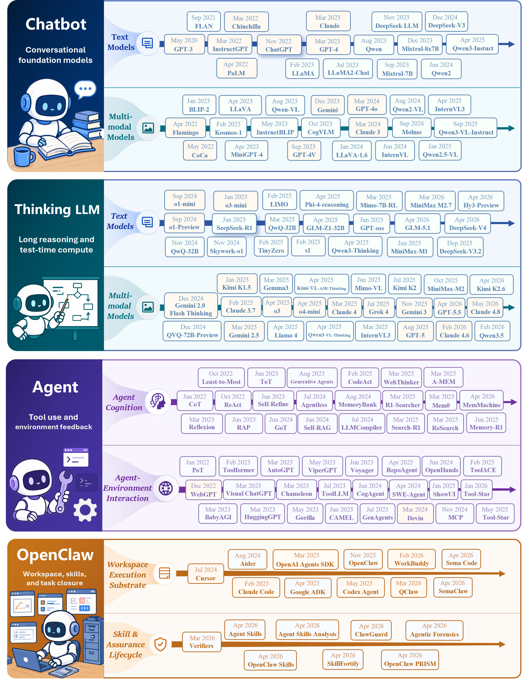

# Next-Generation AI Systems Homepage

This folder stores the code and design notes for the paper homepage:

- Repository: https://github.com/Next-Generation-AI-Systems/Next-Generation-AI-Systems.github.io
- GitHub Pages: https://next-generation-ai-systems.github.io/
- Source paper TeX folder: `../youtu_survey`

## Paper Identity

- Paper title: `Next-Generation AI Systems`
- Running header: `Next-Generation AI`
- LaTeX class: Tencent YouTu Lab template, based on an ICLR-style article layout.
- Main visual direction: clean research-paper page, Tencent YouTu blue accents, pale blue paper panels, dark neutral text, compact academic spacing.

Relevant TeX sources:

- `../youtu_survey/youtu.cls`
- `../youtu_survey/survey.tex`

## Logo Assets

Primary institution/logo assets found in the paper project:

| Asset | Size | Notes |
| --- | ---: | --- |
| `../youtu_survey/figures/tencentyoutu.png` | 834 x 133 | Main Tencent YouTu logo used in the paper page header. |
| `../youtu_survey/figures/youtu_logo.png` | 850 x 298 | Larger YouTu logo asset, useful for homepage hero or footer branding. |
| `../youtu_survey/figures/youtulogo.jpg` | 900 x 900 | Square logo/avatar-style asset. |
| `../youtu_survey/logo/thu_log.png` | 3596 x 1217 | Tsinghua logo asset available in the project, not used by the current header. |

The current paper header is configured with:

```tex
\fancyhead[L]{\includegraphics[height=2\baselineskip]{figures/tencentyoutu.png}}
\fancyhead[R]{\tencentsanswseven{Next-Generation AI}}
```

## Core Palette

These colors are defined or overridden in the LaTeX source and should be treated as the homepage design tokens.

| Token | RGB / Source | Hex | Intended Usage |
| --- | --- | --- | --- |
| `youtuBlue` | `RGB(0, 82, 217)` | `#0052D9` | Tencent primary blue; section headings, primary links, key accents. |
| `youtuLightBlue` | `RGB(235, 245, 255)` | `#EBF5FF` | Original abstract/background panel color in `youtu.cls`. |
| `FigureBackground` | `RGB(237, 245, 254)` | `#EDF5FE` | Paper overrides `youtuLightBlue` to this value; use for hero and paper panels. |
| `AIboxBackground` | `RGB(238, 245, 253)` | `#EEF5FD` | Background for AI/info callout boxes. |
| `AIboxFrame` | `RGB(54, 85, 140)` | `#36558C` | Callout border/title color. |
| `youtuText` | `HTML 1C2B33` | `#1C2B33` | Main body text. |
| `youtuBg` | `HTML F1F4F7` | `#F1F4F7` | Subtle page/background neutral. |
| `darkblue` | `rgb(0, 0.40, 0.75)` | `#0066BF` | Hyperlink, citation, and URL color in `survey.tex`. |
| `blue` | `RGB(55, 83, 156)` | `#37539C` | Figure legend strokes and secondary blue accents. |

## Supporting Accent Palette

Use these sparingly for figures, tags, legends, or small comparison elements.

| Token | RGB | Hex |
| --- | --- | --- |
| `hidden-red` | `RGB(205, 44, 36)` | `#CD2C24` |
| `hidden-blue` | `RGB(194, 232, 247)` | `#C2E8F7` |
| `hidden-orange` | `RGB(243, 202, 120)` | `#F3CA78` |
| `hidden-green` | `RGB(34, 139, 34)` | `#228B22` |
| `hidden-pink` | `RGB(255, 245, 247)` | `#FFF5F7` |
| `hidden-black` | `RGB(20, 68, 106)` | `#14446A` |
| `purple` | `RGB(144, 153, 196)` | `#9099C4` |
| `yellow` | `RGB(255, 228, 123)` | `#FFE47B` |
| `hidden-yellow` | `RGB(255, 248, 203)` | `#FFF8CB` |
| `tkcolor` | `RGB(224, 223, 255)` | `#E0DFFF` |
| `myblue` | `RGB(215, 226, 240)` | `#D7E2F0` |
| `lightcream` | `RGB(252, 249, 242)` | `#FCF9F2` |

## Typography Notes

- The class defines and uses `TencentSans-W7` for title, author, affiliation, and running header branding.
- The paper body imports `mathpazo`, `XCharter`, and scaled `zlmtt`.
- For the web version, prefer a practical stack close to the paper feel:

```css
font-family: "Source Sans Pro", "Segoe UI", Arial, sans-serif;
color: #1C2B33;
```

## Homepage Style Guidance

- Use `#0052D9` as the primary action/accent color.
- Use `#EDF5FE` or `#EEF5FD` for abstract, hero, and explanation panels.
- Keep body text dark neutral with `#1C2B33`; avoid a single-color blue-only page.
- Use the Tencent YouTu logo as a first-screen institutional signal when appropriate.
- Keep cards and callouts modest, paper-like, and information dense.
- Prefer clear academic sections: abstract, roadmap, resources, figures, citation, and links.

## Single-Page Homepage Plan

The website should be a single-page, scroll-based paper homepage. It does not need routing, login, search, dashboards, or complex app logic. The main interaction is a top navigation bar with anchor links that jump to sections on the same page.

### Global Structure

- Page type: static single-page research homepage.
- Navigation behavior: top navigation with anchor links and smooth scrolling.
- Main navigation labels: `Overview`, `Roadmap`, `Cognitive Core`, `Task Execution`, `Workspace + Skill`, `Data & Eval`, `Future`, `Resources`.
- Visual language: Tencent YouTu research-paper style, using `#0052D9`, pale blue panels, dark text, and clean academic spacing.
- Favicon: use `assets/logos/youtulogo.jpg` because it is square and suitable for browser tabs.
- Header logo: use `assets/logos/tencentyoutu.png` as the institution/logo mark in the top navigation.
- Page logo/wordmark: combine the Tencent YouTu logo with the paper title text `Next-Generation AI Systems`.

### Section-by-Section Plan

| Anchor ID | Nav Label | Section Function | Main Content | Figures / Assets | Layout Notes |
| --- | --- | --- | --- | --- | --- |
| `#hero` | Home | First-screen identity and quick entry. | Paper title `Next-Generation AI Systems`; subtitle/core claim `From Chatbot to Digital Colleague`; author placeholders `Author One`, `Author Two`, `Author Three`; affiliation placeholders `Affiliation One`, `Affiliation Two`; primary buttons for Paper, Code, Data, Citation. | `assets/logos/tencentyoutu.png`, `assets/logos/youtulogo.jpg`, `assets/figures/png/abs.png`, resource icons in `assets/icons/`. | The hero should show the paper identity immediately. Use `abs.png` as the main first-screen visual summary, with title/authors above it or beside it depending on viewport. |
| `#overview` | Overview | Give visitors the paper's official abstract and core contribution highlights before detailed figures. | Use the paper abstract verbatim, without rewriting or paraphrasing; then add 3-4 separate contribution highlights: cognitive core evolution, task execution, Workspace + Skill paradigm, data/evaluation shift. | `assets/figures/png/abs.png` | Can reuse `abs.png` as a visual abstract. If repeated from hero, show it smaller or as a captioned figure. |
| `#roadmap` | Roadmap | Explain the paper's overall taxonomy and system evolution. | The roadmap from chatbot systems to thinking LLMs, agents, and workspace systems; timeline/time-horizon interpretation. | `assets/figures/png/map.png`, `assets/figures/png/horizon.png` | Make `map.png` a wide primary figure. Use `horizon.png` as a secondary timeline or supporting panel below. |
| `#cognitive-core` | Cognitive Core | Explain how LLMs evolve from fast conversational systems to deliberate reasoning systems. | Chatbot-era fast thinking, next-token prediction, chain-of-thought, reflection, process supervision, test-time compute, reinforcement learning. | `assets/figures/png/chatbot.png`, `assets/figures/png/thinkingllm.png` | Present as a before/after section: Chatbot on the left/top, Thinking LLM on the right/bottom. |
| `#task-execution` | Task Execution | Explain how reasoning systems become action-taking systems. | Tool use, environment feedback, agent loops, fragility of simple agents, move toward task closure, OpenClaw-style workstation systems. | `assets/figures/png/agent.png`, `assets/figures/png/openclaw.png` | Use `agent.png` to introduce the agent loop and `openclaw.png` to show the stronger system architecture. |
| `#workspace-skill` | Workspace + Skill | Explain the paper's central system-level paradigm. | Persistent workspace, reusable skills, state persistence, verification loops, task closure, experience reuse, governance. | `assets/figures/png/tool.png`, `assets/figures/png/workspace.png` | This should be one of the most important sections. Use a strong heading and prominent figure placement. |
| `#data-eval` | Data & Eval | Explain the shift in data and evaluation methodology. | Data moves from instruction-response pairs to State-Action-Observation trajectories; evaluation moves from static benchmarks to sandboxed, auditable, evolving environments. | `assets/figures/png/data.png`, `assets/figures/png/eval.png` | Treat as two paired subsections: Data Construction and Evaluation. |
| `#future` | Future | Close the paper narrative with open questions and direction. | Key challenges, safety/governance, reliability, long-horizon work, future AI workstations and self-evolving ecosystems. | `assets/figures/png/challenges.png`, `assets/figures/png/future.png` | Use `challenges.png` before `future.png` to create a problem-to-outlook flow. |
| `#gallery` | Gallery | Ensure every figure is available for scanning and reuse. | A compact figure gallery with captions and optional open/download affordances. | All files in `assets/figures/png/` | Keep gallery secondary, because figures should already appear in context above. |
| `#resources` | Resources | Provide all practical links and citation material. | Paper PDF link, code link, dataset link, project links, BibTeX block, correspondence email, acknowledgements. | `assets/icons/github.png`, `assets/icons/huggingface-color.png`, `assets/icons/icons8-email-96.png`, `assets/icons/icons8-date-96.png`, `assets/icons/icons8-website-100.png`, `assets/icons/icons8-robot-100.png` | Use clear icon buttons or compact resource rows. |

### Hero Content Details

The first screen should include:

- Institution logo: `assets/logos/tencentyoutu.png`
- Paper title: `Next-Generation AI Systems`
- Subtitle / slogan: `From Chatbot to Digital Colleague`
- Author placeholders:
  - `Author One*`
  - `Author Two`
  - `Author Three`
- Affiliation placeholders:
  - `Affiliation One`
  - `Affiliation Two`
- Metadata placeholders:
  - Date: `June 13, 2025`
  - Correspondence: `email@example.com`
  - Dataset: `https://huggingface.co/datasets/XXXX`
- Primary actions:
  - `Paper`
  - `Code`
  - `Data`
  - `Citation`
- First-screen visual: `assets/figures/png/abs.png`

### Navigation Details

The top navigation should be visible at the top of the page and link to same-page anchors:

```html
<nav>
  <a href="#overview">Overview</a>
  <a href="#roadmap">Roadmap</a>
  <a href="#cognitive-core">Cognitive Core</a>
  <a href="#task-execution">Task Execution</a>
  <a href="#workspace-skill">Workspace + Skill</a>
  <a href="#data-eval">Data & Eval</a>
  <a href="#future">Future</a>
  <a href="#resources">Resources</a>
</nav>
```

Optional JavaScript is acceptable for smooth scrolling or active-section highlighting, but it is not required. Native anchor links are enough for the first implementation.

## Website Copy Draft

This section drafts the text that should appear on the website. The abstract must use the paper's original wording. Contribution highlights and section introductions may be shorter website copy, but they should remain faithful to the paper.

### Top Navigation Copy

- Brand text: `Next-Generation AI Systems`
- Logo image: `assets/logos/tencentyoutu.png`
- Navigation links:
  - `Overview`
  - `Roadmap`
  - `Cognitive Core`
  - `Task Execution`
  - `Workspace + Skill`
  - `Data & Eval`
  - `Future`
  - `Resources`

### Hero Section Copy

Section anchor: `#hero`

Eyebrow:

```text
Tencent YouTu Lab Research Paper
```

Title:

```text
Next-Generation AI Systems
```

Subtitle:

```text
From Chatbot to Digital Colleague
```

Lead paragraph:

```text
A survey of how large language models are evolving from conversational answer generators into integrated AI systems for reasoning, action, memory, and self-improvement.
```

Author line placeholder:

```text
Author One*, Author Two, Author Three
```

Affiliation line placeholder:

```text
1 Affiliation One    2 Affiliation Two
```

Metadata placeholder:

```text
Date: June 13, 2025
Correspondence: email@example.com
Data: https://huggingface.co/datasets/XXXX
```

Primary buttons:

```text
Paper
Code
Data
Citation
```

Hero figure caption:

```text
Overview of the transition from conversational chatbots to persistent digital colleagues.
```

Image:

- `assets/figures/png/abs.png`

### Overview Section Copy

Section anchor: `#overview`

Heading:

```text
Abstract
```

Abstract text:

```text
Large Language Models (LLMs) are undergoing a fundamental transformation from conversational generators into integrated AI systems for reasoning, action, memory, and self-improvement. We conceptualize this transition as a shift from Chatbot to Digital Colleague: from conversational answers to persistent work. We organize this transition along two tightly coupled dimensions. First, at the cognitive core level, LLMs evolve from Chatbot-era "fast thinking" systems driven by next-token prediction to Thinking LLMs that use inference-time computation, Chain-of-Thought reasoning, reflection, process supervision, and reinforcement learning for deliberate cognition. Second, at the tool-augmented task execution level, LLMs progress from fragile Agents that invoke tools into OpenClaw-style workstation systems (OpenClaw) with persistent Workspaces, skills, verification loops, and governance. The proposed "Workspace + Skill" paradigm turns episodic tool use into colleague-like work, enabling state persistence, reusable procedures, task closure, and experience reuse. Finally, we examine shifts in data construction from instruction-response pairs to State-Action-Observation trajectories and evaluation from static benchmarks to sandboxed, auditable, self-evolving AI ecosystems.
```

Contribution block heading:

```text
Key Contributions
```

Contribution cards:

```text
1. A two-dimensional view of next-generation AI systems: cognitive-core evolution and tool-augmented task execution.
2. A unified account of the shift from Chatbot to Digital Colleague through the Workspace + Skill paradigm.
3. A system-level framing of task closure, persistent state, reusable procedures, verification, and governance.
4. A data and evaluation perspective that moves from instruction-response pairs to State-Action-Observation trajectories and auditable AI ecosystems.
```

Image:

- `assets/figures/png/abs.png`

### Roadmap Section Copy

Section anchor: `#roadmap`

Heading:

```text
Roadmap of Next-Generation AI Systems
```

Intro paragraph:

```text
The paper organizes the evolution of AI systems across two coupled dimensions. The first dimension is the cognitive core, where LLMs move from fast conversational generation to deliberate reasoning. The second dimension is tool-augmented task execution, where models move from simple tool-using agents toward persistent workspace systems that can complete and verify digital work.
```

Map figure caption:

```text
A roadmap and evolutionary timeline showing how AI systems progress from chatbots to reasoning cores, tool-using agents, and persistent workspace systems.
```

Horizon figure caption:

```text
Time horizon growth shows the movement from short response generation toward longer, more complex, and sustained task completion.
```

Images:

- `assets/figures/png/map.png`
- `assets/figures/png/horizon.png`

### Cognitive Core Section Copy

Section anchor: `#cognitive-core`

Heading:

```text
Cognitive Core: From Fast Response to Deliberate Reasoning
```

Intro paragraph:

```text
The first axis of the paper concerns how the model itself thinks. Chatbot-era systems are fast, stateless generators that compress broad knowledge into immediate responses. Thinking LLMs introduce slower cognition through inference-time computation, long reasoning traces, reflection, process supervision, and reinforcement learning.
```

Subsection heading:

```text
Chatbot Era
```

Subsection text:

```text
In the Chatbot Era, a user asks a natural-language question, the model performs fast single-pass inference over compressed parametric knowledge, and the system returns a fluent response. This made language modeling a universal interface, but it also exposed limits in deep reasoning, verification, long-horizon consistency, and self-correction.
```

Figure caption:

```text
The Chatbot Era: fast, stateless, single-pass response generation without external feedback loops or persistent memory.
```

Subsection heading:

```text
Thinking LLM Era
```

Subsection text:

```text
Thinking LLMs allocate additional computation at inference time. They generate longer reasoning traces, explore alternatives, verify intermediate steps, and revise before returning an answer. This shifts the cognitive core from immediate response generation toward deliberate, trial-and-error reasoning.
```

Figure caption:

```text
The Thinking LLM Era: slow, reflective reasoning with longer chains, verification, and deeper search.
```

Table introduction:

```text
The following representative-model tables summarize the transition from non-reasoning chatbot-era LLMs to reasoning-oriented Thinking LLMs.
```

Images:

- `assets/figures/png/chatbot.png`
- `assets/figures/png/thinkingllm.png`

Tables:

- `tab_chatbotllm.tex`
- `tab_thinkingllm.tex`

### Task Execution Section Copy

Section anchor: `#task-execution`

Heading:

```text
Task Execution: From Agents to OpenClaw
```

Intro paragraph:

```text
The second axis asks how a stronger cognitive core becomes a system that can act. The Agent Era introduces environment-action-feedback loops, where models observe external states, choose tools or actions, receive feedback, and iterate. The OpenClaw Era goes further by embedding action inside persistent workspaces with files, terminals, browsers, logs, permissions, reusable skills, and verification loops.
```

Subsection heading:

```text
Agent Era
```

Subsection text:

```text
Agent systems break from single-turn answering by allowing LLMs to plan, call tools, browse websites, write code, manipulate files, and react to observations. However, these systems remain fragile when intermediate errors, missing observations, failed calls, or unrecovered state changes derail the trajectory.
```

Figure caption:

```text
The Agent Era: observe, think, act, receive feedback, and iterate toward a task goal.
```

Subsection heading:

```text
OpenClaw Era
```

Subsection text:

```text
OpenClaw-style systems treat the workspace as the host of work. Actions become inspectable workspace operations over files, terminals, browsers, services, and skills. The objective shifts from producing useful intermediate actions to delivering a correct, recoverable, and auditable final state.
```

Figure caption:

```text
The OpenClaw Era: persistent workspaces, reusable skills, verification loops, and governed task closure.
```

Boundary table introduction:

```text
The boundary table clarifies why OpenClaw is not just another agent loop: the organizing abstraction changes from external tool interaction to persistent workspace-based task hosting.
```

Images:

- `assets/figures/png/agent.png`
- `assets/figures/png/openclaw.png`

Tables:

- `tab_agent.tex`
- Inline `tab:agent_openclaw_boundary`

### Workspace + Skill Section Copy

Section anchor: `#workspace-skill`

Heading:

```text
Workspace + Skill: The Mechanism Behind Digital Colleagues
```

Intro paragraph:

```text
The key thesis of the survey is that Workspace + Skill turns episodic interaction into durable digital work. A workspace provides state, evidence, recoverability, and consequences. A skill provides reusable operational knowledge, including procedures, scripts, checks, safety constraints, and recovery behavior.
```

Tool figure caption:

```text
Simple tool invocation helps with local sub-tasks, but isolated calls are not enough for long-horizon work that requires files, sessions, logs, artifacts, and recoverable state.
```

Workspace figure caption:

```text
The Workspace + Skill paradigm combines persistent environments with reusable procedures so agents can produce verifiable digital work instead of one-off responses.
```

Table introduction:

```text
Representative OpenClaw-era works show how workspace intelligence, skills, task closure, reliability, security, and governance become part of the same system-level problem.
```

Images:

- `assets/figures/png/tool.png`
- `assets/figures/png/workspace.png`

Tables:

- `tab_openclaw.tex`

### Data & Evaluation Section Copy

Section anchor: `#data-eval`

Heading:

```text
Data & Evaluation: From Static Answers to Auditable Work
```

Intro paragraph:

```text
As AI systems move from answering questions to acting in workspaces, both data and evaluation must change. Training data can no longer be only instruction-response pairs. Evaluation can no longer be only final-answer correctness. The unit of learning and measurement becomes the complete state-action-observation trajectory and the verified final workspace state.
```

Data subsection heading:

```text
Data Construction
```

Data subsection text:

```text
Chatbot data centers on static corpora, demonstrations, preferences, and dialogue corrections. Thinking LLM data adds reasoning traces, intermediate steps, and process supervision. Agent and OpenClaw data must capture tool outputs, UI states, file changes, terminal errors, permissions, workspace snapshots, reusable skills, and final-state evidence.
```

Data figure caption:

```text
Data evolves from prompt-response pairs to reasoning traces and state-action-observation trajectories.
```

Evaluation subsection heading:

```text
Evaluation
```

Evaluation subsection text:

```text
Evaluation moves from scoring endpoints to judging processes and completed work. Next-generation systems must be assessed by reasoning validity, environment state changes, reliability, efficiency, reproducibility, safety, and task closure.
```

Evaluation figure caption:

```text
Evaluation shifts from final-answer correctness to process judgment, workspace-level task closure, and auditable execution.
```

Evaluation stages intro:

```text
The Stage I-IV benchmark tables show how evaluation expands from final-output scoring to process-level reasoning, task closure, and workspace/OpenClaw evaluation.
```

Stage table labels:

```text
Stage I: Final-Output Evaluation
Stage II: Process-Level Reasoning Evaluation
Stage III: Task-Closure Evaluation
Stage IV: Workspace and OpenClaw Evaluation
```

Images:

- `assets/figures/png/data.png`
- `assets/figures/png/eval.png`

Tables:

- `tab_data.tex`
- `tab_evaluation.tex`
- `tab_stage1_final_output.tex`
- `tab_stage2_process_level.tex`
- `tab_stage3_task_closure.tex`
- `tab_stage4_workspace_openclaw.tex`

### Future Section Copy

Section anchor: `#future`

Heading:

```text
Challenges and Future Directions
```

Intro paragraph:

```text
Reliable autonomy introduces new challenges because failures are no longer isolated wrong answers. They become longer-horizon, stateful, harder to reverse, and tied to real workspace changes. Future AI systems need stronger task closure, safer permissions, better memory, robust context management, skill governance, reproducible evaluation, and self-improving operating environments.
```

Challenges subsection heading:

```text
Open Challenges
```

Challenges subsection text:

```text
The core bottlenecks include reliable task closure, safety and governance, persistent memory, context management, recoverable workspace state, skill provenance, and trajectory-level verification.
```

Challenges figure caption:

```text
Open challenges for reliable autonomy in persistent workspace systems.
```

Future subsection heading:

```text
Toward Self-Evolving AI Ecosystems
```

Future subsection text:

```text
The long-term direction is an integrated ecosystem where models, contexts, tools, skills, workspaces, memories, evaluators, and governance mechanisms form a learning loop. In this view, AI systems become governed digital colleagues that accumulate experience and improve the environments in which they work.
```

Future figure caption:

```text
Future directions toward self-evolving AI ecosystems.
```

Images:

- `assets/figures/png/challenges.png`
- `assets/figures/png/future.png`

### Gallery Section Copy

Section anchor: `#gallery`

Heading:

```text
Figure Gallery
```

Intro paragraph:

```text
Browse the complete visual set from the paper. Each figure is also used in context above, while this gallery provides a compact place to scan the full visual narrative.
```

Gallery item captions:

```text
Abstract Overview
Roadmap
Time Horizon Growth
Chatbot Era
Thinking LLM Era
Agent Era
OpenClaw Era
Tool Invocation
Workspace + Skill
Data Paradigm Shift
Evaluation Paradigm Shift
Open Challenges
Future Directions
```

Images:

- All files in `assets/figures/png/`

### Resources Section Copy

Section anchor: `#resources`

Heading:

```text
Resources
```

Intro paragraph:

```text
Access the paper, code, data, citation, and project resources for Next-Generation AI Systems.
```

Resource labels:

```text
Paper
Code
Data
Project
Demo
Contact
```

Citation heading:

```text
Citation
```

Citation placeholder:

```bibtex
@article{next_generation_ai_systems,
  title   = {Next-Generation AI Systems},
  author  = {Author One and Author Two and Author Three},
  year    = {2025},
  note    = {Project page: https://next-generation-ai-systems.github.io/}
}
```

Footer text:

```text
Next-Generation AI Systems. A project page for the paper From Chatbot to Digital Colleague.
```

## Table Integration Plan

The paper includes several important tables in addition to figures. They should be included in the homepage, but with different treatments depending on their size and purpose.

General rule:

- Short paradigm/boundary tables should be shown directly in the narrative.
- Large survey/catalog tables should be placed in collapsible sections with horizontal scrolling.
- Benchmark result matrices should be presented as expandable evaluation tables, supported by a short plain-language summary.
- Tables should be converted to semantic HTML tables instead of screenshots, so that text remains searchable, selectable, accessible, and responsive.

### Discovered Tables from TeX

| Table Source | Topic / Caption | Recommended Homepage Placement | Web Treatment | Decision |
| --- | --- | --- | --- | --- |
| `../youtu_survey/figure/tab_chatbotllm.tex` | Representative non-reasoning LLMs in the Chatbot era. The TeX file contains a continued table because the catalog is long. | `#cognitive-core`, after `chatbot.png`. | Collapsible table titled `Representative Chatbot-Era LLMs`; horizontal scroll on mobile; optional filters for `Open / Closed / Mixed` and `Text / Multi / Code`. | Include, but not directly expanded by default. |
| `../youtu_survey/figure/tab_thinkingllm.tex` | Representative reasoning LLMs in the Thinking LLM era. | `#cognitive-core`, after `thinkingllm.png`. | Collapsible table titled `Representative Thinking LLMs`; use the same visual treatment as the Chatbot-era table for comparison. | Include, but not directly expanded by default. |
| `../youtu_survey/figure/tab_agent.tex` | Representative works related to LLM-based agents and enabling capabilities. | `#task-execution`, after `agent.png`. | Collapsible grouped table; group rows by category such as Architecture, Perception, Planning, Memory, Tool Use, Benchmark. | Include; useful as the agent capability map. |
| `../youtu_survey/Sections/3.Task_Execution.tex` inline table `tab:agent_openclaw_boundary` | Boundary between the Agent Era and the OpenClaw Era. | Between `#task-execution` and `#workspace-skill`, or immediately before `openclaw.png`. | Directly visible compact comparison table with columns `Dimension`, `Agent Era`, `OpenClaw Era`. | Include directly; this is a key explanatory bridge. |
| `../youtu_survey/figure/tab_openclaw.tex` | Representative works related to the OpenClaw era and workspace-level task execution. | `#workspace-skill`, after `workspace.png` or after the Agent/OpenClaw boundary table. | Collapsible grouped table; group by Workspace, Skill, Task Closure, Evaluation, Reliability, Security, Governance. | Include; strong support for the Workspace + Skill section. |
| `../youtu_survey/figure/tab_data.tex` | Data paradigm shift from static knowledge corpora to verifiable action trajectories. | `#data-eval`, near `data.png`. | Directly visible table; this is compact enough and central to the narrative. | Include directly. |
| `../youtu_survey/figure/tab_evaluation.tex` | Evaluation paradigm shift from final-answer scoring to process judgment and workspace-level task closure. | `#data-eval`, near `eval.png`. | Directly visible table; pair with the data paradigm table. | Include directly. |
| `../youtu_survey/figure/tab_stage1_final_output.tex` | Stage I final-output evaluation models/methods and benchmark scores. | `#data-eval`, in an `Evaluation Stages` subsection. | Collapsible benchmark matrix with a short summary before the table. | Include as expandable supporting evidence. |
| `../youtu_survey/figure/tab_stage2_process_level.tex` | Stage II process-level reasoning evaluation. | `#data-eval`, in the same `Evaluation Stages` subsection. | Collapsible wide benchmark matrix; requires horizontal scroll and sticky first column if implemented. | Include as expandable supporting evidence. |
| `../youtu_survey/figure/tab_stage3_task_closure.tex` | Stage III task-closure evaluation. | `#data-eval`, after Stage II and before workspace/OpenClaw evaluation. | Collapsible benchmark matrix; highlight that these metrics evaluate interactive task success. | Include as expandable supporting evidence. |
| `../youtu_survey/figure/tab_stage4_workspace_openclaw.tex` | Stage IV workspace and OpenClaw evaluation, including ClawSafety ASR where lower is better. | `#data-eval` and cross-link from `#workspace-skill` / `#future`. | Collapsible wide benchmark matrix; add note that lower ASR is better for safety. | Include as expandable supporting evidence. |

### Revised Section Plan with Tables

| Homepage Section | Figures | Tables |
| --- | --- | --- |
| `#hero` | `abs.png`, logo assets | No table. |
| `#overview` | `abs.png` | No table; use short contribution cards instead. |
| `#roadmap` | `map.png`, `horizon.png` | No table; roadmap should stay visual. |
| `#cognitive-core` | `chatbot.png`, `thinkingllm.png` | `tab_chatbotllm.tex`, `tab_thinkingllm.tex` as collapsed representative-model catalogs. |
| `#task-execution` | `agent.png`, `openclaw.png` | `tab_agent.tex` as collapsed catalog; inline `tab:agent_openclaw_boundary` shown directly. |
| `#workspace-skill` | `tool.png`, `workspace.png` | `tab_openclaw.tex` as collapsed grouped table. |
| `#data-eval` | `data.png`, `eval.png` | `tab_data.tex` and `tab_evaluation.tex` shown directly; Stage I-IV benchmark tables collapsed below. |
| `#future` | `challenges.png`, `future.png` | Cross-link to Stage IV/OpenClaw evaluation table and show only a short safety/governance summary here. |
| `#gallery` | All PNG figures | Optional table index linking to all table sections. |
| `#resources` | Resource icons | No data table; include BibTeX/citation block. |

### Table UX Pattern

Use direct tables for compact conceptual comparisons:

```html
<section id="agent-openclaw-boundary">
  <h3>Agent Era vs. OpenClaw Era</h3>
  <div class="table-scroll">
    <table>
      <thead>
        <tr>
          <th>Dimension</th>
          <th>Agent Era</th>
          <th>OpenClaw Era</th>
        </tr>
      </thead>
      <tbody>
        <!-- rows converted from the TeX table -->
      </tbody>
    </table>
  </div>
</section>
```

Use collapsed tables for long catalogs and benchmark matrices:

```html
<details class="paper-table">
  <summary>Representative Thinking LLMs</summary>
  <div class="table-scroll">
    <table>
      <!-- converted table rows -->
    </table>
  </div>
</details>
```

Suggested table styling:

- Use `#EDF5FE` for table header background.
- Use `#36558C` for header text or subtle borders.
- Keep row height compact.
- Enable horizontal scrolling on mobile.
- For very wide benchmark tables, keep the first column sticky if a small JavaScript/CSS enhancement is acceptable.
- Add one sentence above every large table explaining why it matters, so visitors do not have to parse the whole matrix first.

## Figure Asset Handling

The paper stores its main figures as PDF files in the original TeX project, but this homepage folder keeps only PNG web assets. This keeps the GitHub Pages repository lighter and makes every figure directly usable with normal responsive HTML image elements.

Current policy:

- Keep homepage figures under `assets/figures/png/`.
- Do not copy PDF figure sources into this repository.
- If a PNG needs to be regenerated, convert it from the original paper source in `../youtu_survey/figure/`.

Browsers can display PDFs through `<iframe>` or `<object>`, but PDF files are not reliable as ordinary `` sources across browsers and devices. Therefore, the homepage should use PNGs for all figure display.

Recommended HTML pattern:

```html
<figure>
  
  <figcaption>Roadmap and timeline.</figcaption>
</figure>
```

Conversion command for regenerating a PNG from the original TeX figure source:

```powershell
pdftoppm -png -r 160 -singlefile ../youtu_survey/figure/map.pdf assets/figures/png/map
```

## Copied Figure Inventory

All core paper figures referenced by the TeX source have been copied into this homepage folder as PNG web-display assets.

| Figure | PNG for Web | Suggested Homepage Role |
| --- | --- | --- |
| Abstract overview | `assets/figures/png/abs.png` | Hero or abstract visual summary. |
| Roadmap | `assets/figures/png/map.png` | Main roadmap section. |
| Horizon | `assets/figures/png/horizon.png` | Timeline/time-horizon supplement. |
| Chatbot | `assets/figures/png/chatbot.png` | Chatbot-era cognitive core. |
| Thinking LLM | `assets/figures/png/thinkingllm.png` | Reasoning and test-time compute. |
| Agent | `assets/figures/png/agent.png` | Tool-using agent workflow. |
| OpenClaw | `assets/figures/png/openclaw.png` | Task closure and workstation system. |
| Tool | `assets/figures/png/tool.png` | Tool-use and skill interface. |
| Workspace | `assets/figures/png/workspace.png` | Persistent workspace paradigm. |
| Data | `assets/figures/png/data.png` | Data construction section. |
| Evaluation | `assets/figures/png/eval.png` | Evaluation section. |
| Challenges | `assets/figures/png/challenges.png` | Open challenges. |
| Future | `assets/figures/png/future.png` | Future directions. |

Copied branding and metadata assets:

- `assets/logos/tencentyoutu.png`
- `assets/logos/youtu_logo.png`
- `assets/logos/youtulogo.jpg`
- `assets/logos/thu_log.png`
- `assets/icons/github.png`
- `assets/icons/huggingface-color.png`
- `assets/icons/icons8-date-96.png`
- `assets/icons/icons8-email-96.png`
- `assets/icons/icons8-website-100.png`
- `assets/icons/icons8-robot-100.png`
